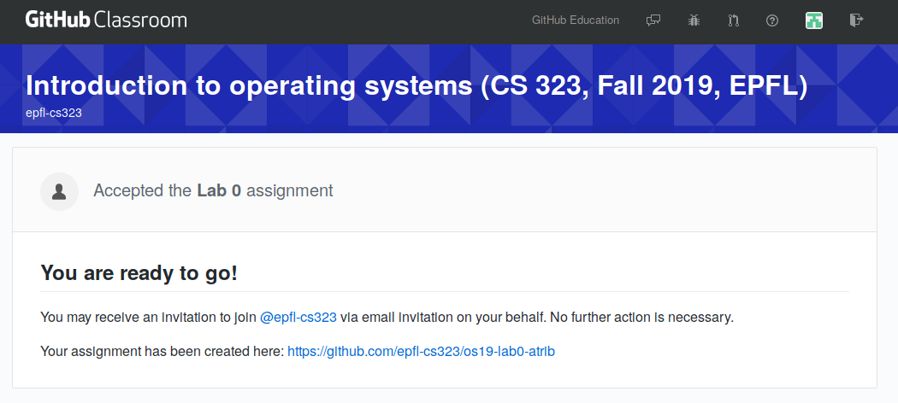

# Introduction to Operating Systems

<!-- Authors:
    Atri Bhattacharyya (atri.bhattacharyya@epfl.ch)
    Ahmad Hazimeh (ahmad.hazimeh@epfl.ch)
-->

## Introduction

Welcome to the project for CS-323. In this lab, we shall be implementing 
various operating system functions, such as scheduling, concurrency 
primitives and more. 

Our objectives for this week are:
1. Set up the lab environment
1. Introduction to the submission system via Github Classroom. 
1. Refresher exercises in C

## Lab environment 

The labs are designed assuming a standard Ubuntu/Linux environment,
and will be graded within a docker container. Therefore, you should
be able to code and test your code on your own laptops, using your
own IDEs/code editors on your own platform. The submissions will use
Github Classroom, so you must be able to use `git` on your machine.

The labs will include two major methods for testing:
- `make test` will run your own tests, natively. For this, you
  need to have the necessary compilers and libraries on your machine.
  These will include `gcc`, `gdb`, `build-essentials` and `check`. You
  are strongly encouraged to write tests and debug your submission on
  your machine.
- `make feedback` will run tests provided by the TAs, within a docker
  container. The container will contain the necessary environment,
  including all installed compilers/libraries. Your machine merely needs
  to be able to run [Docker](https://www.docker.com). Containers provide
  a lightweight, consistent virtualization environment. Docker containers are
  significantly lighter than VMs, requiring less hardware support, and spawning
  almost instantaneously. For a quick tutorial on Docker, check out this
  [video](https://www.youtube.com/watch?&v=fqMOX6JJhGo). The test container
  is based on Ubuntu 20.04.

> Note: Please follow the post-installation steps for Docker on Linux.
  This will enable you to spawn containers as non-root users.

## Github Classroom

We shall use Github classroom to distribute lab assignments for this course.
For each new lab, you will receive a link to the assignment. 
The first thing you need is a GitHub account. If you do not have one,
you can create it [here](https://github.com/join). You can use a 
free account, there is no need for a paid version. If you already have
an account, feel free to use it for this course.

Once you have a GitHub account, you must register for the assignments using 
a specific link which we shall provide (and will look like 
https://classroom.github.com/a/71uysUdE). Once you open the link, you may
be asked to provide the permissions to GitHub Classroom to access your
repositories. 

Then you will have to choose your SCIPER number from a list. If you are enrolled
for the course but your SCIPER does not appear on this list, contact a TA.

Thereafter, you will be able to join the first lab (lab 0).

Once this is done, you should receive a message from GitHub telling you that 
you have joined the "Lab 0" assignment and you have in your GitHub repositories 
a `os19-lab0-YOUR_GITHUB_ID` repository whose URI should look like this:
`git@github.com:epfl-cs323/os19-lab0-YOUR_GITHUB_ID.git`.

For this URI to work, you must register your SSH public key in GitHub. 
You can [do it here](https://github.com/settings/ssh) by following the
instructions from this 
[help page](https://help.github.com/en/articles/connecting-to-github-with-ssh).

Finally, you can 
[clone](https://help.github.com/en/articles/cloning-a-repository) 
the repository onto your own machine and start working on the lab exercises.

## Lab 0, week 1

For every assignment, we shall provide you starter code in the `provided/` 
directory. *Do not edit* any files within this directory. Copy the 
contents of this folder into a new folder: `done/` and make changes there.
*Only* files found in `done/` will be considered for grading. Remember to 
commit your work regularly. The final state of the repository at the 
deadline will be considered for grading. 

*Hint: You can use git branches to commit work-in-progress without affecting your
submission on the main branch.* 
[Branching tutorial](https://git-scm.com/book/en/v1/Git-Branching-What-a-Branch-Is)

In this week, we provide the following files:
1. `provided/week01.h`: Header file for the exercises
1. `provided/week01.c`: Implementation for the exercises. Look at the TODOs
in this file.
1.`provided/tests.c`: Skeleton for unit testing. Add your own tests here.
1. `provided/Makefile`: For building your files. Run `make test` to run
unit tests.

There are 4 exercises. The first exercise requires you to implement a simple
string comparison function. To see the expected behavior, consult the manpage
for `strcmp` (`man strcmp`). This is to familiarize yourself with C character
arrays/strings.

The second exercise requires debugging a simple linked list implementation in 
which there are two simple bugs. You have to fix them. Both bugs are a 
one-line fix. The third exercise requires printing a provided binary tree 
with different orderings. These exercises are to help you recollect working
with C pointers.

Finally, the last exercise is an alphabet frequency counter where you count
the number of occurences of each English letter in the text from a file.
This is meant to help you recollect file I/O.

## Lab 0, week 2
In this week, we provide the following additional files:
1. `provided/week02.h`: Header file for the exercises
1. `provided/week02.c`: Implementation for the exercises. Look at the TODOs in
   this file.
1. `provided/main.c`: Sample function calls with provided inputs and expected
   outputs. Use these as preliminary test cases.

As with the previous lab, you have to implement some functions in the provided
files. The descriptions of these functions are available in the header file,
`provided/week02.h`. There are 3 functions to implement: `w2_bork()`,
`w2_fork()`, and `w2_clone()`.

The first exercise requires you to complete a provided function outline to
fork a parent process into `n` child processes. Each child calls `verify()` when
it spawns, then it terminates. The parent waits for every spawned child to exit
before spawning the next. A more descriptive specification is available in the
description of `w2_bork()`.

The second exercise requires you to implement a function that forks the parent
processes in a tree structure based on a provided skeleton binary tree. The
skeleton tree represents the execution timeline: starting from the initial root
process, children fork off the main timeline and complete their own tasks, which
could include also forking off other children themselves. When children finish
their tasks, they terminate, allowing the root process to control the main
execution path at all times. A more descriptive example is available in the
description of `w2_fork()`.

The third exercise requires you to extend `w2_fork()` to allow parent processes
to create threads to accomplish parallel tasks, before forking off to children.
Each parent process has a specific number of threads to spawn before forking,
and that number is also specified as part of the provided skeleton tree in
`w2_clone()`. A more descriptive example is available in the description of
`w2_clone()`.

In all functions, verification methods are provided as arguments. These methods
must be called as specified in the descriptions of the functions, to allow our
unit tests to verify that your solution is correct.

Sample code is also provided in `main.c`, showing you how binary skeleton trees
are represented sequentially (in array format). Dummy verification functions are
also provided, to print out the structure of the forked processes and allow you
to partially debug your code.
