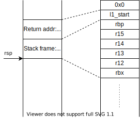
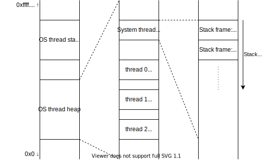
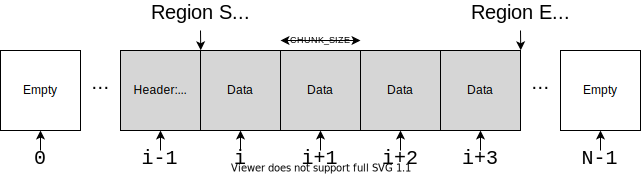
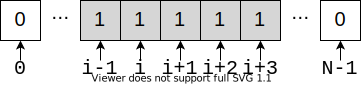

# Lab 1: Threading in Userspace

## Introduction

In this laboratory, we shall implement a userspace threading library that
allows multiple execution contexts (or threads) to be time-multiplexed onto a
single OS thread. Threads that are scheduled by such userspace libraries are
generally called green threads. Green threads require less state than OS
threads, and are easier to switch between.

The goals of this lab are multifold:
- Be able to characterise the state of a green thread
- Implement the basic thread operations: create and join
- Implement different scheduling policies
- Implement different memory allocators 

The threads shall be co-operatively scheduled, i.e., threads are responsible
for yielding control to the scheduler when it cannot do useful work. This
reduces the complexity of the scheduler because there is no asynchronous
behavior or timers. On the other hand, faulty/malicious threads can cause
deadlocks or other threads to be starved of CPU time.

This lab shall span three weeks, and has a deadline of 23h00 on 26/10/2021. There are 
three phases:
- Threading: creation of thread (released 05/10)
- Scheduling: implementation of different scheduling policies (released 11/10), and
- Allocators: implementation of different memory allocators (released 18/10).

For every assignment, we shall provide you starter code in the `provided/` 
directory. *Do not edit* any files within this directory. Copy the 
contents of this folder into a new folder: `done/` and make changes there.
*Only* files found in `done/` will be considered for grading. 

Remember to commit your work regularly. The final state of the main repository
branch at the deadline will be considered for grading. Having regular commits
helps you debug your code by comparing version across time and allows you to
revert to past versions if needed. A clear progress history will also help your
case if you encounter submission problems ("My internet got cut-off five minutes
before the deadline") or in litigation.

## Thread State

Let us first look at the API for green threads. There are two main functions:

- [`l1_error l1_thread_create(l1_tid *thread, void *(*start_routine)(void *), void *arg);`](../provided/thread.c)
- [`l1_error l1_thread_join(l1_tid thread, void **retval);`](../provided/thread.c)

The call to create a green thread explains the purpose of that thread: to
execute the function `void *start_routine(void *)` with the provided argument
`arg`. It also writes a unique identifier for the thread to the first pointer,
`thread` so that the return pointer can be obtained by calling `l1_thread_join`.
This API is very similar to the `pthread` API but requires less state.

Every green thread operates on its own private stack that is allocated on the
OS thread's heap. The state of the green thread, therefore, is characterised
by the following:
- Unique identifier
- Current status: Running, runnable, blocked or zombie. We explain these states later.
- Start routine: The function the thread executes
- Arguments: For the start routine
- If blocked, we also need to track which thread we are waiting for.

### Thread switching

The context of a thread can be summarized by its stack and the CPU registers. In
the provided framework, each thread has its own stack region allocated in
memory. In order to switch between threads, it thus suffices to save the needed
CPU registers and the thread's latest stack pointer, stored in the `sp`
register.

To perform the context switch, the provided framework calls
[`switch_asm`](../provided/schedule.c), which performs the following steps:

1. Pushes the CPU registers directly on the switching (source) thread's stack
2. Saves the source thread's `sp` to its internal thread info struct
3. Restores the target (destination) thread's `sp`
4. Pops the registers from the target thread's stack

Context switching is performed through a cooperative call to `yield(...)`.
Each thread can call `yield(-1)` to return control to the system thread (and
indirectly the scheduler), or `yield(target)` to return control to the target
thread directly (useful to start a main thread). Thus, context switching is a
function call, and it abides by the ABI used by the compiler. `gcc` uses the
[System-V](https://wiki.osdev.org/System_V_ABI), which specifies which
registers must be preserved across function calls (callee-saved). Hence, when
calling `yield`, a thread expects only that set of registers to be preserved,
which is a small subset of all the available CPU registers, reducing the
context switching overhead.

At thread creation, the stack is initially empty (freshly allocated). However,
the provided framework expects that the thread's context (register values) is
saved on its stack. Therefore, it is the responsibility of the thread creation
function to set up the stack such that the needed register values are pushed on
it in a specific order. This order is portrayed by the following figure:

For the purposes of stack alignment, the initial value of the stack pointer 
needs to be eight bytes below the alignment boundary (16B). An easy way to 
achieve this is to push any 8B word to the stack before pushing `l1_start`. 
This preserves compatibility with the System-V ABI, which requires that 
"the stack is 16-byte aligned just before the call instruction is called."

Initial register values can be set to any value (preferably zero). When
`switch_asm` switches to a new thread's context, it restores the saved registers
on the stack, and jumps to the first address on the stack (the return address).
When `l1_start` is executed, it bootstraps the thread to call its assigned
routine, stored in the thread's info struct, inside the `thread_func` data
member, which takes `thread_func_args` as an argument. As such, in the steady
(running) state, a thread's stack looks as portrayed in the following figure:

## Scheduling

Unlike your desktop's operating system, the threads in this lab are
co-operatively scheduled. This means that threads are not pre-empted, instead
running until they yield to the scheduler. As an argument to the `yield()`
call, one can pass the ID of the thread to which they wish to yield to.

There are various operations that can result in a thread yielding CPU such as
thread joining, waiting on communication primitives such as mutexes,
semaphores or messaging. In this lab, we only implement waiting on other
threads. In later labs, we will see some of the other forms.

There are 4 states that a thread may be in:
- Running: This means that the thread is currently executing
- Runnable: This means that the thread has not finished, is not blocked and
may be executed.
- Blocked: This means that the thread is waiting on some event. For example,
`join` causes a thread to be blocked waiting for another thread to complete.
- Zombie: This means that the thread has finished its execution, but has not been
deleted yet.

Scheduling is the task of choosing which thread gets to run when we yield the
CPU. As discussed in the lectures, there may be various policies to choose
the next task when there are multiple runnable threads. In this lab, we
provide two mechanisms for changing tasks. `yield` takes a parameter `next`
which specifies which is the next thread to run, optionally yielding to the
system thread when the argument is -1. In this case, the scheduler is
responsible for choosing the next task, and it uses the policy as specified
in `sched_policy select_next;` field in the scheduler structure. An example
policy (round robin) is implemented in
[`sched_policy.c`](../provided/schedule.c) and will be used for week 3. In
later weeks, we will introduce and implement other policies.

## Tasks for week 3

In this week, we require you to implement thread creation and thread joining,
specifically [`l1_thread_create`](../provided/thread.c) and
[`l1_thread_join`](../provided/thread.c).

### l1\_thread\_create 

For creating a new thread, you have to primarily do two jobs: firstly, you
must set up the `l1_thread_info` structure to accurately reflect the new
thread's starting state. Secondly, you must setup the stack where the new
thread can execute. However, the thread state must also allow the thread to
cleanly exit when the `start_routine` finishes.

For this purpose, we provide you with the function `l1_start(void)` which
acts as a caller for `start_routine`. Essentially, we setup the stack to
reflect the state within `switch_asm` where the original thread's stack
pointer is replaced by the destination thread's stack pointer. Therefore,
when the scheduler selects the new thread and tries to switch to it, it will
see a state equivalent to a thread which has called `switch_asm`.

Essentially, the entry point to `l1_start` acts as the return
address for `start_routine`.

_Hint: Return address for the call stack are stored on the stack in stack frames. 
For more information about stack frames on x86-64, refer to 
<https://eli.thegreenplace.net/2011/09/06/stack-frame-layout-on-x86-64/>_ 

### l1\_thread\_join

For joining on a target thread, you will need to set-up the `l1_thread_info`
before yielding to the scheduler. 

This function is expected to fail with the error code `ERRINVAL` if the 
target thread does not exist.

As with `pthread_join`, the behavior when multiple threads join on the same
target are undefined. Therefore, you are not required to check if other threads
are waiting on the same target.

### More information about join

`join` is used to tell the scheduler that the current thread does not want to
run until the target is done running. The current thread, i.e., the one that
called join, must setup information in its own *l1_thread_info* structure to
let the scheduler know how it should be handled.

The important fields are: 

1. *state*: the current thread's info should use this field to tell the
scheduler that it wants to block.
2. *joined_target*: the current thread's info should contain the target's tid 
(thread id) value.
3. *join_recv*: the current thread's info should contain the retval pointer,
i.e., the variable in which the current thread will receive the target's
return value.
4. *errno*: this field is used by the scheduler to communicate with the
thread. It should be initialized to SUCCESS before yielding to the
system. After returning from the system thread, i.e., when the current thread
gets re-scheduled, errno will hold either SUCCESS, or an error value if the
system thread was unable to make the current thread join on its target (e.g.,
the target does not exist, or got joined by someone else first).

In `join`, you should:

1. Make sure the current thread's *l1_thread_info* structure contains correct
values for these fields.
2. Yield to the scheduler.
3. Check the *errno* value from the current thread's *l1_thread_info*
structure. This is what join should be returning.
4. Clean up the current's thread *joined_target*, *errno*, and *join_recv*.
5. Return the value (SUCCESS or an error) you read at point 3.

## Tasks for week 4

This week, you will add new scheduling policies to the
[`sched_policy.*`](../provided/sched_policy.c)
[files](../provided/sched_policy.h), replacing the simple round robin
scheduler from last week. You will be in charge of implementing two policies
named `l1_smallest_cycles_policy` and `l1_mlfq_policy`. The first policy
simply picks the thread that has been running for the fewest cycles. The
second policy is the one you learned about in class, called Multi-Level
Feedback Queues (MLFQ).

### Extensions to `l1_thread_info`

For this lab, `l1_thread_info` was extended with new attributes that you will
need to correctly initialize in `l1_thread_create`:

1. *priority_level:* the thread's priority level used by MLFQ. All threads
start at `TOP_PRIORITY`, defined in `priority.h`.
2. *got_scheduled:* indicates when the thread has been selected by the
scheduler.
3. *total_time:* accumulator for the total time this thread has been executing.
4. *slice_start:* absolute time measurement taken when the thread gets
selected by the scheduler to execute next.
5. *slice_end:* absolute time measurement taken when the thread gets
descheduled by the scheduler.

All time values are of type `l1_time`, defined in `l1_time.c/.h`. These files
provide functions to initialize, add, subtract, compare, and get time
measurements. This allows to replace the implementation of `l1_time` with
simpler or more complex types.

### Scheduling policy API

We have provided you an enhanced `schedule()` function since the last lab.
You do not have to edit `schedule()` to implement the various scheduling
policies. All scheduling policies have the same interface, i.e.,
`l1_thread_info* (*sched_policy)(l1_thread_info* prev, l1_thread_info*
next)`. A few rules must be observed when implementating a policy in order to
stay compatible with the `schedule()` function:

1. A policy should *not* remove `prev`, `next`, or the selected target from
its list. The scheduler moves `prev` to the end of the runnable queue (if it
is runnable) before calling the scheduling policy function. The scheduler
also moves a thread to the head of the queue right before scheduling it.
2. A policy can decide to ignore `next` and select its own thread to schedule
next. In other words, the scheduling policy can *bypass* the yield semantics.
3. The selected thread to run next must be `RUNNABLE` and be inside the list
of runnables.
4. The `prev` value is the thread that just executed and is never NULL. The
scheduler is allowed to inspect and change its priority and time metrics, but
not its list or state.
5. The `schedule()` function updates `total_time`, `slice_start`, and
`slice_end` *before* calling your scheduling policy. In other words, you do
not need to modify these values, unless you want to reset them.

### Smallest cycles policy

The first scheduling policy that you need to implement is
`l1_smallest_cycles_policy`. It works in the following way:

1. If the suggested `next` value is not null, the policy should return that
thread.
2. Otherwise, find the runnable thread with the smallest `total_time`
value and schedule it.

The `total_time` value is set for you by the `schedule()` function.

### MLFQ

The second scheduling policy you need to implement is `l1_mlfq_policy` and is
more complicated. As explained in the course's *scheduling* slides,
multi-level feedback queues (MLFQ) define 6 rules:

1. `if priority(A) > priority(B) then return A`
2. `if priority(A) == priority(B) then A, B run in round robin`
3. All threads should be initialized with top priority.
4. If a thread uses up its whole time slice, demote it to lower priority
(time slices are longer at lower priority).
5. If a thread has not been run for some time, increase its priority by one
level. In our case, a boost should occur once every `SCHED_PERIOD` calls to
schedule.
6. If a thread's total time **at its current priority level** (not just the
last time slice) has exceeded a threshold time, demote it to a lower
priority.

**IMPORTANT** When implementing these 6 rules, pay attention to whether or not
multiple rules apply to the same thread, and what order to apply them in. You
should consider this when updating any data structures, as the
demotions/promotions from one rule, may trigger another.

To help you implement `l1_mlfq_policy`, we provide several helper functions
and attributes:

1. `l1_priority_slice_size` defined in [`priority.*`](../provided/priority.c)
returns, for a given priority level, the corresponding maximum slice size.
2. `TIME_PRIORITY_THRESHOLD` defined in `priority.*` is the threshold described
in rule 6.
3. `l1_priority_decrease` allows you to decrease the priority level of a thread.
4. `l1_priority_increase` allows you to increase the priority level of a thread.
5. The `l1_scheduler_info` structure has an attribute called `sched_ticks`,
incremented everytime the `schedule` method runs. This value goes from 0 to
`SCHED_PERIOD - 1` and defines a periodic time for use with Rule 5.
6. The `l1_thread_info` attribute `got_scheduled` is set to the value of
`scheduler->sched_ticks` just before switching execution to this thread.

The MLFQ policy ignores the `next` target in favour of the 6 above rules.  MLFQ
is, however, responsible for updating the priority level of the `prev` thread.
If MLFQ decides to change *any* thread's priority level (increase *or*
decrease), it is responsible for resetting the `l1_thread_info` attributes
described above (e.g., `total_time`, etc.). MLFQ should
*not* change a thread's state (e.g., changing it to BLOCKED) or touch the
scheduler queues themselves.

## Tasks for week 5: Heap Management

The heap is an area in memory dedicated for storing dynamically-allocated
objects. Heap allocators are used to manage the heap and keep track of allocated
and free regions. There is no single optimal strategy to manage the heap;
different strategies are used depending on the type of application and the
nature of its allocations (object sizes, allocation frequency, support for
resizing, internal and external fragmentation). The most common general-purpose
heap allocator is [glibc's
`malloc()`](https://www.gnu.org/software/libc/manual/html_node/The-GNU-Allocator.html),
which is based on `ptmalloc`. It is not unusual, however, to see
performance-critical applications, like network
protocol libraries and web browsers, using custom implementations of heap
allocators, which best suit their use-cases.

In this lab, we will implement two different methods for managing a fixed-size
heap area, i.e., the size of the heap area itself will not change. Both methods
will support re-use of free'd (previously allocated) regions in the heap.
However, each method will use fundamentally different data structures to track
heap usage. This will highlight how flexible heap allocators can be, depending
on the required features and constraints (metadata overhead, fragmentation,
complexity and performance, security).

In both case, if the function fails to find a suitable region, it must set
`l1_errno` to `ERRNOMEM` and return a NULL pointer.

### Chunk Allocator

The first heap allocator we will implement is a chunk allocator. Its core
mechanism is to divide the heap area into equally-sized chunks, and keep track
of each chunk's allocation state (reserved or free) in a bitmap or array. A
region is then allocated by reserving contiguous free chunks, whose total size
fits the requested region size. Additionally, metadata about that region (mainly
its size, in bytes), is stored at the beginning of a header chunk directly
preceding that region. The header is formatted according to the `region_hdr_t`
data type. The following figure portrays an arbitrary state of the heap with one
allocated region of requested size `S == 4*CHUNK_SIZE`:

When serving an allocation request, the allocator needs to know which sections
of the heap are free to reserve. To that extent, the chunk allocator uses a
bitmap to track each chunk's reservation state. To simplify the implementation
of the allocator and make it easily extensible, the bitmap is stored as an array
of `chunk_desc_t` objects, one for each chunk in the heap. In the simplest case,
this object maps directly to a Boolean value that indicates whether its chunk
is reserved (1) or free (0). For the heap state in the previous figure, the
state of the chunk metadata array is as follows:

To allocate a region of `S` bytes, 
contiguous chunks must be reserved. The overhead for every allocated region is
then `M * sizeof(chunk_desc_t) + CHUNK_SIZE + ((M - 1) * CHUNK_SIZE - S)` bytes.
`M * sizeof(chunk_desc_t)` represents the number of bytes needed to store
metadata for each allocated chunk. `CHUNK_SIZE` represents the number of bytes
dedicated solely for the region header. `((M - 1) * CHUNK_SIZE - S)` represents
the number of padding bytes in the last chunk in the region, which are due to
internal chunk fragmentation (S could be a non-multiple of CHUNK_SIZE). To
allocate `M` chunks, the allocation function starts the search from chunk 0,
iterates through the chunk metadata array to find the first sequence of `M` free
chunks, and reserves them. This is called the first-fit allocation method.

The region header metadata surrounds the `size` field with a couple of magic
values used as canaries to verify if the header had been corrupted (e.g., heap
overflow). This is useful for the `free()` operation, allowing it to verify the
integrity of the heap before destroying/releasing chunks. To free a region, its
header is inspected to calculate the number of chunks it has reserved. Then, all
chunks, including the header chunk, are released by setting their state to free
(0) in the chunk metadata array.

In this lab, we provide you with the skeleton of the chunk allocator and its
heap setup and tear-down routines (init and deinit), in
[`malloc.h/c`](../provided/malloc.h). Moreover, the constants, macros, data
structures, and global objects are also defined and
must be used, as is, to enable proper grading.

It is thus your task to implement `chunk_malloc` and `chunk_free` in
[`malloc.c`](../provided/malloc.c). There is also a one TODO in
`l1_chunk_init` and `l1_chunk_deinit`.

One thing to notice about this allocator is that, due to the nature of its
allocation mechanism (by searching for `M` free contiguous chunks), it
inherently supports merging of consecutive free chunks. The worst-case
complexity of the allocation function is O(N), and that of its free function is
also O(N), where `N` is the total number of chunks.

We also notice that for a requested chunk of just 1 byte, the overhead is `2 *
sizeof(chunk_desc_t) + 2 * CHUNK_SIZE - S`, where `sizeof(chunk_desc_t)` is 1
byte and `CHUNK_SIZE` is reasonably large, e.g. 1 KiB. This amounts to a
worst-case overhead of 2049x! This is mainly due to the fact that data is stored
in an integral multiple of `CHUNK_SIZE`, and the region header alone occupies an
entire chunk.

By dividing the heap area into fixed-size chunks and maintaining a bitmap of
each chunk's reservation state, we introduced the following problems:

1. Regions are aligned to chunk boundaries: big padding overhead.
1. Chunk reservation states are maintained individually: big metadata overhead.

### List Allocator

In the second exercise, we will follow a different heap management approach,
which will inherently solve the problems introduced by the chunk allocator.

To solve the first problem, we could reduce the value of `CHUNK_SIZE` in the
chunk allocator, for instance, to 1 Byte. However, this would require a separate
chunk metadata struct for every byte in the heap, which introduces a lot of
overhead. To solve the problem of chunk metadata overhead, we could aggregate
the state of the next `M` free "chunks" into one entry. For instance, instead of
storing `M` consecutive entries, each indicating that one chunk is free, we
could store one entry that indicates that the next `M` consecutive chunks are
free.

Based on these observations, we could use a small "chunk" size of `N` Bytes (N
would be much smaller than 1 KiB), such that padding is mostly eliminated, and
for each next `M` contiguous free bytes in the heap, we store one entry
describing them. We could set `N` to 1, thus minimizing padding overhead, but
due to some platform limitations and performance considerations, it is best to
choose `N` such that memory accesses are properly aligned. As such, we choose `N
:= sizeof(max_align_t)`. **Keep note of this when deciding the minimum region
size, and when calculating the size for an allocation request**. Hence, in a
similar fashion to the chunk allocator, an **aligned** request size must be
first calculated to be an integral multiple of `N`, equal to or exceeding the
original request size. For example, if the original request size is 2 Bytes, and
if `N == 32`, then `aligned_sz := 32`.

Similarly to the chunk allocator, region metadata is inlined in the heap, just
before the region's start boundary. However, unlike the chunk allocator, there
will not be any external/out-of-line "chunk" metadata array. Instead, we will
track free regions by forming them into a singly-linked list within the heap.

There are two types of regions: reserved and free. Each region is directly
preceded by a metadata header describing that region. The metadata header for a
reserved region contains information specifying the size of the region. The
sequence of bytes in a reserved region thus resembles the following layout:

In this example layout, the size of the metadata is assumed to be 4 Bytes. The
total size occupied in memory by the region and its header is `TOTAL_SIZE`
Bytes. Thus, it is clear that the size/capacity specified by the region's header
is `REG_SIZE := TOTAL_SIZE - 4` Bytes.

A free region's metadata also specifies its size, in addition to specifying the
location of the next free region in memory, in order to form the linked list.
The sequence of bytes in a free region thus resembles the following layout:

Notice that the size/capacity specified in the region's header does not include
the space occupied by the metadata storing the `next` pointer. In other words,
**a free region's header specifies the region's capacity as if it was a reserved
region**. When searching for a free region suitable for allocation, that
region's capacity must be compared to the requested allocation size. If it is a
suitable fit, the free region will be reserved, thus discarding the `next`
pointer, and using that space to store data. This is due to the fact that
reserved regions are not tracked in memory, so their metadata header does not
include a `next` pointer. Instead, data in reserved regions starts directly
after the metadata header which only specifies the size/capacity of that region.

The initial state of the heap resembles that of a free region where `TOTAL_SIZE
== HEAP_SIZE`. On the other hand, an arbitrary state of the heap with one
allocated region is portrayed in the following figure:

To allocate a region of size `S` bytes, the list of free regions is traversed,
starting from the head, in search for the first free region that fits the
requested size. If the free region is big enough, part of it can be reserved for
storing the requested size, and the remaining free part can become a new
(smaller) free region and replace the original (bigger) free region in the list.
An example of this can be inferred from the previous figures: consider the state
of the heap where one region is reserved in the middle. Before that region was
reserved, it was likely part of a bigger free region **R**, the one formed by
combining the two regions of capacities `REG2_SIZE` and `REG3_SIZE` as in the
following figure:

Upon allocating a region of `REG2_SIZE`, the allocator found **R** to be of
sufficient size and reserved the first part of it to store `REG2_SIZE` Bytes of
data, in addition to some region metadata. The allocator then designated the
remainder of the region as another smaller free region, whose capacity is
`REG3_SIZE`, and updated the linked list to reflect the change, by pointing the
previous free region's `next` field to the newly formed free region.

On the other hand, if the free region is big enough to store the requested size,
but not enough to be followed by another free region (not enough remaining space
to store metadata), the entire region is used up and is removed from the linked
list. This results in a small amount of padding at the end of the region which
introduces little overhead.

To determine whether or not a free region can be split, you must first define a
minimum region size, hereafter referred to as `min_reg_sz`. `min_reg_sz` is the
total number of bytes required to store a **reserved region with a capacity of 1
Byte**. `min_reg_sz` thus includes the reserved region's metadata, in addition
to a **properly aligned** "chunk" to store 1 Byte of data. Next, if the capacity
of the free region equals or exceeds `aligned_sz + min_reg_sz`, then the region
must be split.

In our implementation, the region header surrounds the `size` field with a
couple of magic values used as canaries to verify if the header had been
corrupted (e.g., heap overflow). This is useful for the `free()` operation,
allowing it to verify the integrity of the heap before destroying/releasing
regions and re-ordering the linked list. To free a region, we simply insert it
at the head of the linked list of free regions (no traversal required). In the
previous example, freeing the region with `REG2_SIZE` Bytes results in the
following layout:

Notice how the head of the list is re-assigned to be the newly free'd region,
and that region's `next` now points to the previous head.

In this lab, we provide you with the skeleton of the list allocator and its
heap setup and tear-down routines (init and deinit) , in
[`malloc.h/c`](../provided/malloc.h). Moreover, the constants, macros, data
structures, and global objects are also defined and must be used as is to
enable proper grading.

It is thus your task to implement `list_malloc` and `list_free` in
[`malloc.c`](../provided/malloc.c). Again, there is again some minimal setup
in `l1_chunk_init` and some teardown in `l1_chunk_deinit` for you to
complete.

To reiterate the initial motiviation for the list-based allocator:

1. Regions are aligned to small boundaries: little padding overhead.
2. Region reservation states are aggregated: one metadata entry describes an
   entire contiguous region; little metadata overhead.

The worst-case complexity of the allocation function is O(N), where N is the
number of nodes/entries in the list of free regions, and that of the free()
function is O(1).

It is important to notice that, **based on this specification**, the allocator
does **not** support merging of free chunks. Although this is not an inherent
limitation of the list-based approach, this feature is not required for this
exercise, and grading will assume that consecutive free regions are not merged.

