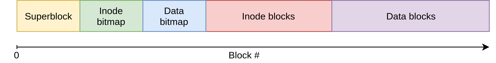

# Lab 3: File systems

## Overview

Release date: 17/11/2021

Due date: 07/12/2021 at 23:59 CET

Steps:

1. implement `read_from_disk` in `fs_util.c`.

2. implement `find_inode_by_path` in `fs_util.c`.

3. implement the file system API using the previous two functions:

	* `lab3_open`

    * `lab3_close`

    * `lab3_seek`

    * `lab3_readdir`

	* `lab3_read`

In this lab you will implement a simple file system called Lab3FS. You will
start by implementing a few helper functions that you will use later in the
homework. Then, you will use these helpers to implement a Unix-like API that
can be used to read the file system.

We provide you starter code in the `provided/` directory. *Do not edit* any
files within this directory. Copy the contents of this folder into a new
folder: `done/` and make changes there.
*Only* files found in `done/` will be considered for grading. The final state
*of the main repository branch at the
deadline will be considered for grading*. In addition, we ask you to commit
your code regularly. Having regular commits helps you debug your code by
comparing version across time and allows you to revert to past versions if
needed. It can also be a handy cloud backup if anything goes awry with your computer. A clear progress history will also help your case if you encounter
submission problems ("My internet got cut-off five minutes before the
deadline") or in litigation.
## ASan

For this lab we have enabled
[Address Sanitizer (ASan)](https://github.com/google/sanitizers/wiki/AddressSanitizer)
in the provided makefile.
ASan is a compiler feature that adds sanity checks around all memory accesses,
and detects common memory errors. When your code triggers a memory error (for
example by accessing an array out of bounds), ASan will crash it and print an
error report that shows exactly where the error happened. ASan is very useful
for debugging, because memory errors are often subtle and hard to find. As you
will see later, you will often have to copy data around various buffers in this
lab and tool that highlights your memory errors is therefore extremely helpful.

Let's start with an example of how ASan works:

```c
#include <stdio.h>
#include <stdlib.h>

int main(int argc, char *argv[])
{
    if (argc < 2) {
        return 0;
    }

    int i = atoi(argv[1]);
    int array[4] = {1, 2, 3, 4};

    printf("%d\n", array[i]);

    return 0;
}
```

This example takes an argument `i` on the command line and uses it as an index
into an array. When `0 <= i < 4` everything works as expected and the program
produces the right result.

```
$ ./asan_example 0
1
```

However what happens when `i` is outside of the valid range? (you might get a different output)

```
$ ./asan_example 16
-512275656
```

In this case our example program accessed an array out of bounds and read what
is effectively an arbitrary value. The C standard says that a program like this
has *undefined behavior* (i.e. anything could happen). Most importantly our
program didn't crash, and silently returned an unexpected value.

Because our example is so small, the bug is easily spotted. But what if this
snippet was part of a larger program that used the value read from the array in
another operation? A bug like this could easily go unnoticed and cause a crash
in another, seemingly unrelated, part of the program.

Now, let's try to compile our example with ASan. In order to do that, we simply
have to add `-fsanitize=address` to the command line arguments of our compiler
(only works with Clang and GCC). We have already done this for you in the
makefile for this lab.

```
$ clang -g -fsanitize=address -o asan_example asan_example.c

$ ./asan_example 5
=================================================================
==1208==ERROR: AddressSanitizer: stack-buffer-overflow on address 0x7ffee810d914 at pc 0x000107af2d16 bp 0x7ffee810d8d0 sp 0x7ffee810d8c8
READ of size 4 at 0x7ffee810d914 thread T0
    #0 0x107af2d15 in main asan_example.c:13
    #1 0x7fff6f78c2e4 in start (libdyld.dylib:x86_64+0x112e4)

[... more output follows and the program is terminated]
```

When our program tried to access the array out of bounds (at index 5), ASan
detected the error, printed some debugging information, and crashed it. This is
similar to what would happen in a memory safe language such as Java or Rust.

As you can see in the output, ASan printed the file and line where our program
accessed the array out of bounds, and told us that what type of error it
generated (stack buffer overflow). This is invaluable for debugging because it
shows exactly where the bug is located and doesn't let the error propagate
silently to other parts of the program. ASan can detect many kinds of memory
errors, such as buffer overflows (both on the stack and on the heap),
use-after-free, and double free.

If you run into an ASan error while testing your solution to the homework, don't
just disable ASan in the makefile, fix the bug instead! When ASan complains,
it means that there is a bug in your code and fixing it immediately could save
you many minutes (or hours) of debugging later.

## Lab3FS

The file system that you will implement in this lab is called Lab3FS.
Lab3FS is inspired by vsfs, which is described in
[chapter 40 of OSTEP](http://pages.cs.wisc.edu/~remzi/OSTEP/file-implementation.pdf).
You can read this chapter to get a feeling for the concepts and data structures
that you will see when implementing the file system; however keep in mind that
Lab3FS is different from vsfs and, for example, some of the data structures are
not the same.

Lab3FS stores its data on a simulated disk which we have implemented for you.
From now on we will refer to this as just the "disk" for simplicity.
Just like a real disk, the simulated disk can only be accessed in units of
blocks (a block is 4KiB). This means that even if you want to read just one
byte from the middle of a block, you will have to read the entire block and
extract your data from there.

The emulated disk uses a file on the (host) file system as backing storage.
Before you use any of the functions that access the disk, you need to call
`open_emu_disk` and pass it the path of the file system image that you want
to use. We have provided 3 filesystem images that you can use to test your code
in `test_fs` and you can generate your own images with `generate_test_fs.py` (
see below). When you're done with a disk image, call `close_emu_disk`.

The first block on a disk is called a superblock and contains some metadata
about the file system such as the number of blocks used to store data. Next
come two blocks for allocation bitmaps, which we won't use in this lab. You can
ignore those.

Immediately after the bitmap blocks are some blocks that contain *inodes* (see
below). The number of inode blocks is specified in the superblock. Finally, the
rest of the disk is used to store the actual content of the files.



### Inodes

One of the main data structures of every file system is the *inode*. An inode
contains metadata about a file or directory, such as its name, and the location of
its data on the disk. Lab3FS stores an inode for each file and directory in the
inode blocks, which we described above.

Lab3FS's inode structure is defined in `fs_structs.h`:

```c
struct lab3_inode {
    uint32_t id;
    char name[MAX_NAME_SIZE];
    uint32_t is_directory;

    union {
        struct {
            uint32_t size;
            disk_off_t data_block_offsets[MAX_DATA_BLOCKS_PER_INODE];
        } file;

        struct {
            uint32_t num_children;
            disk_off_t children_offsets[MAX_DATA_BLOCKS_PER_INODE];
        } directory;
    };
} __attribute__ ((aligned (256)));
```

Each inode contains a numeric unique identifier (`id`), the name of the file
or directory associated to it, and a field that specifies whether it represents
a file or a directory. File inodes contain the size of the file and the disk
offsets of the file's data blocks. Directory inodes contain the number of
children of the directory and the disk offsets of the inodes of the directory's
children. The inode structure is padded so that its size is 256 bytes. This way
the size of a disk block is a multiple of the size of an inode, which simplifies
the code.

The offsets that refer to other data blocks on the disk (`data_block_offsets`
and `children_offsets`) are in bytes from the start of the disk.

### Open File Table

The other data structure that we will use to implement Lab3FS is the Open File
Table, which the file system uses to know which files are currently open. In
Unix-like systems an open file is represented by a *file descriptor*, an integer
value. When an application on a Unix-like system opens a file with `open`, it
receives a file descriptor for that file. The application can then pass the file
descriptor to other functions like `read` to use the file it just opened. What
this means for us is that our implementation of Lab3FS needs a way to remember
which file is associated to an open file descriptor. We have implemented this
using a global array called the *open file table*, defined in
`open_file_table.{h,c}`. In our implementation file descriptors will simply be
indices into this array.

The open file table is an array of `lab3_open_file` structures with
`MAX_OPEN_FILES` elements. Each element contains a pointer to an in-memory copy
of the inode for the corresponding file and a *seek offset*. The seek offset is
the offset into the file at which the next read operation will take place.

## Generating File System Images

We have included a Python 3 script (`generate_test_fs.py`) that you can use to
generate Lab3FS images in the handout. This is very useful for testing your
solution. You can run it with `python3 generate_test_fs.py <directory>
<output>`. The script will read the contents of a directory on your machine's
file system and write them into a file system image. Due to the simplified
design of Lab3FS there are some limitations:

* Links (both symbolic and hard) are not supported.

* A directory can have at most 32 children.

* Files cannot be larger than 128KiB.

* Names cannot be longer than 32 characters.

* Everything (inodes and data) has to fit inside a 4MB image.

By default the script allocates 5 blocks to inodes (enough for 80 between files
and directories, including the root directory) and it will error if it runs out
of inode space. You can increase the number of blocks allocated to inodes by
passing `--inode-blocks <number of inode blocks>` to the script on the command
line.

We encourage you to make your own file system images and use them to test your
solution.

## Task 1: implement `read_from_disk` (10 pts)

In this section you will implement `read_from_disk`, a function which reads
an arbitrary amount of data from an arbitrary position on the disk. The reason
why we need this function is that our emulated disk can only be read in units
of 4 KiB blocks, just like a real disk. This is inconvenient for us because
we will frequently need to read data that is stored in the middle of a block,
for example some of the inodes. This helper function will make our task easier
by allowing us to read data at arbitrary disk offsets.

`read_from_disk` is defined in `fs_util.c` and its prototype looks like this:

```c
int read_from_disk(disk_off_t disk_offset, void *buffer, size_t size);
```

The first argument is an offset from the start of the disk (in bytes): this is
where the data that the caller wants to read is located. The third argument is
the number of bytes that the caller wants to read. The second argument points to
a buffer where you will write the data that the caller requested. This buffer
is allocated and managed by the caller, which must ensure that it's large enough
to hold the data that it requested.

Begin by familiarizing yourself with the functions declared in `blk_io.h`,
especially `get_block`. You will use these to implement `read_from_disk`.

Your implementation should do the following things:

* Check that the arguments supplied by the caller are valid. For example it
make no sense to try to read data past the end of the disk;

* Compute the offset of the disk block that contains the data to read;

* Compute the offset of the data to read inside this disk block;

* Read the block from disk;

* Copy the data that the caller requested into `buffer`;

## Task 2: implement `find_inode_by_path` (20 pts)

Next you will implement `find_inode_by_path`. This function takes the path of a
file or directory inside Lab3FS and returns a pointer to an in-memory copy of
the inode of that file or directory. You will need this function to implement
`lab3_open` and `lab3_readdir`.

`find_inode_by_path` starts from the root directory's inode and traverses the
file system hierarchy until it has found the file or directory that the caller
requested. The function's implementation should follow these steps:

* Read the inode of the root directory from disk. In Lab3FS the root inode is
always the first inode of the first inode block. The inode blocks are stored
immediately after the data bitmap blocks, and so the disk offset (in bytes) to
the root inode is `(<block index of first data bitmap block> + <number of blocks
in the data bitmap>) * <size of a block in bytes>`. The block index and size of
the data bitmap are stored in the superblock. You can use `get_disk_superblock`
(from `fs_util.h`) to receive a pointer to a copy of the superblock. Don't
forget to free your copy of the superblock after you're done with it!

* Find the first component of the path. A path is made of slash-separated strings
of text which we call *components*. For example the components of `/foo/bar` are
`foo` and `bar`. The C standard library function `strtok` can be useful to split
the path into its components.

* Iterate over the children of the root directory to find one whose name matches
the first component of the path. Keeping with our example path of `/foo/bar`,
you need to find a child of the root directory whose name is `foo`. If you don't
find any, then the requested path doesn't exist and the function can return.

* Repeat the previous steps iteratively but use the inode you found in the
previous iteration as the starting point instead of the root inode. You can
implement this with recursion or with a loop. When you find the inode for the
last path component, return a pointer to a copy of that inode. Remember that
you need to check whether an inode is a directory before you try to iterate
over its children. This is not necessary for the root inode, which is always a
directory, but the same is not true for the subsequent iterations of the search.
For example `find_inode_by_path` should return NULL for `/foo/bar` when `/foo`
is a file because files can't have children.

## Task 3: implement the file system API (70 pts)

### `lab3_open` (20 pts)

The first function you will implement is `lab3_open`. Unlike the standard Unix
`open` this function only takes one argument, the path to the file to open.
`lab3_open` should read the inode for the file to open from the disk and
allocate an entry in the open file table for it, then return the file descriptor
for the newly opened file. To implement it, follow these steps:

* Get a copy of the inode of the file to open. You can use `find_inode_by_path`,
which you implemented in the previous step. Remember that `lab3_open` can only
open files, not directories.

* Iterate over the open file table and find a free slot. A free slot's inode
pointer is always NULL. If there are no free slots, `lab3_open` should fail.

* Check that the file is not already open. You can do this by checking the
inode ID of all (valid) elements of the open file table. We don't support
opening a file more than once at the same time because that would complicate
the design of the file system. If the file is already open, `lab3_open` should
fail. You can check for this at the same time as the previous point.


### `lab3_close` (5 pts)

`lab3_close` closes an open file. Lab3FS stores the list of open files in the
open file table, and in order to close a file you just need to remove it from
there (i.e. mark the slot in the open file table as invalid). Remember to free
the inode structure afterwards, or your implementation will leak memory.

### `lab3_seek` (5 pts)

`lab3_seek` changes the seek offset of a file, i.e. the offset into the file
where the next read will get its data from. Each entry in the open file table
contains the seek offset for that file and all you have to do is to set the
offset in the open file table entry for the given file.

### `lab3_readdir` (20 pts)

`lab3_readdir` reads the contents of a directory and returns the list of the
names of its children. This function does **not** work in the same way as the
Unix `readdir`: instead we have opted for a simplified API. Let's take a look at
its prototype:

```c
int lab3_readdir(const char *path, char ***out, uint32_t *out_size);
```

`path` is the path to the directory whose contents we want to read. `out` is
used to return a list of names and it should be a pointer to a `char **` pointer,
which will be initialized by `lab3_readdir` with the address of an array of
strings containing the names of the children. `out_size` is used to return the
number of children of the directory, and like `out` it will be filled in by
`lab3_readdir`. Your implementation should follow these steps:

* Get a copy of the directory's inode using `get_inode_by_path`. You need to
check that the returned inode is for a directory, as files don't have children
to list.

* Allocate space for the list of names that it will return.

* Iterate over the children of the directory and fill in the return array.

Assuming you have implemented all the functions up to this point, you should
now be able to use `lab3_ls` to list the contents of a directory inside a Lab3FS
image. Give it a try!

### `lab3_read` (20 pts)

The last function that you will implement is `lab3_read`, which reads data from
an open file. Its API is the same as that of the Unix `read`. `lab3_read` takes
a file descriptor as its first argument and fills in a caller-provided buffer
with data from that file. It always reads starting at the position equal to
the file's seek offset, and it advances the seek offset on success. To implement
it, follow these steps:

* Begin by using the file descriptor to look up the file's inode and its seek
offset in the open file table.

* Use the information in the inode and the seek offset to compute the starting
address of the data you need on the disk. Remember that a file's data can be
stored in multiple data blocks if the file is larger than one block. The file's
inode contains the disk offsets of all these data blocks.

* Read the data from the disk into the caller's buffer. Keep in mind that the
data request by the caller might span multiple blocks, or cross a block
boundary. Also keep in mind that `read_from_disk` will fail if the read request
crosses a block boundary, and therefore you will need to use a loop and may read
the data in multiple calls to `read_from_disk`.

* Update the seek offset of the file. Keep in mind that if `lab3_read`
encounters an error at any time, it must not update the file's seek offset.

At this point, you will have implemented all of our file system API and you
should be able to use both `lab3_ls` and `lab3_cat`, to list directories and
print the content of files respectively. We provided you with a set of basic tests, skeleton to create more tests
and `generate_test_fs.py` to create file system test images. Apart from those initial tests, **we expect you to write your own**.
It is generally good development hygiene to write test cases while developing code. After graduating, you'll always have to write all
your tests yourself. Use this as an opportunity to practice your test writing skills.

Good luck!
