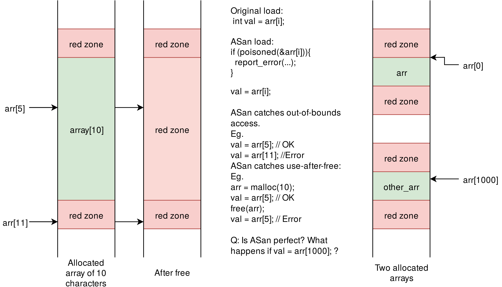
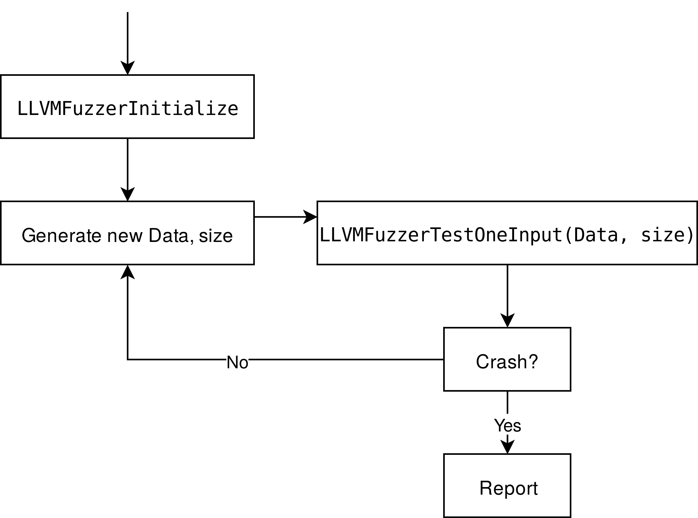

# Lab 4: Sanitization and Fuzzing

## Overview

Release date: 08/12/2021

Due date: 22/12/2020 at 23:59 CET

In this lab, we will investigate sanitization techniques to understand how they
help in finding bugs. Then, we will leverage the power of fuzzers
for automatic test-case generation which greatly increases the chances of
stumbling upon bugs in code. Buckle up!

Steps:
1. Sanitization:
   * Find the 3 bugs in `borsh.c` and save the triggering inputs in `BUG_1.dat`, `BUG_2.dat`, and `BUG_3.dat` under
     `done/01-sanitization/`
   * Fix the bugs in the code by surrounding the fix with `#ifdef PATCH_X`, keeping the original code inside the `#else`
   * Modify the code to allow ASan to detect intra-object overflow, and surround the fix with `#ifdef ASAN_FIX_1`,
     keeping the original code inside the `#else`
1. Fuzzing:
   * Implement the `LLVMFuzzerTestOneInput` function in `fuzzer_simplified.c`
   * Fuzz the two drivers, `fuzzer_native.cpp` and `fuzzer_simplified.c` to find 3 bugs and save the triggering inputs
     in `BUG_1.dat`, `BUG_2.dat`, and `BUG_3.dat` under `done/02-fuzzing/`

**Don't forget:** All your added and modified files must be placed in the `done` directory, under their corresponding
subdirectories (`01-sanitization` and `02-fuzzing`)

Your submitted directory structure should be as follows (presence of additional files may lead to penalization):
```
done/
|
|_ 01-sanitization/
|  |
|  |_ BUG_1.dat
|  |_ BUG_2.dat
|  |_ BUG_3.dat
|  |_ borsh.c
|  |_ Makefile
|  |_ OPTIONAL: demo.c
|
|_ 02-fuzzing/
   |
   |_ BUG_1.dat
   |_ BUG_2.dat
   |_ BUG_3.dat
   |_ fuzzer_native.cpp
   |_ fuzzer_simplified.c
   |_ Makefile
   |_ OPTIONAL: png.dict
   |_ OPTIONAL: magma.tar.gz
   |_ OPTIONAL: libpng-manual.txt
   |_ include/
      |
      |_ png.h
      |_ pngconf.h
      |_ pnglibconf.h
```

## Sanitization

Sanitization is the process of hardening a program's code against invalid
behavior. This includes performing rigorous checks for improper memory accesses,
undefined behavior, invalid type casts, data races, and more!
[AddressSanitizer](https://github.com/google/sanitizers/wiki/AddressSanitizer)
(ASan) is the defacto for validating different types of memory accesses: stack
and heap overflows, use-after-free, double-free, and memory leaks, among some
others. It does so by inserting **red zones** around objects in memory (each
memory object is expanded and padded left and right with a magic area); this
process is called *poisoning*. Then, before each memory access (load or store),
the memory address is checked for poison: if it lies within a red zone, ASan
will report it and crash the program. ASan provides a probabilistic method for
detecting faulty memory accesses. As we'll see in this lab, some invalid
accesses can still pass. Nevertheless, ASan is incredibly effective at finding
subtle memory bugs that would otherwise go unnoticed. The purpose of this lab is
to help you make better use of it now and in your future projects.

The following figure portrays a simple representation of red zones:



If you want to know more about how ASan works under the hood, take a look at
[AddressSanitizerAlgorithm](https://github.com/google/sanitizers/wiki/AddressSanitizerAlgorithm).
Or give the
[USENIX ATC paper](https://www.usenix.org/system/files/conference/atc12/atc12-final39.pdf)
a quick read ;-)

### Getting Started

ASan is included as part of GCC 4.8 and above, and Clang 3.1 and above. It is
enabled by passing the flag `-fsanitize=address` to the compiler, e.g.,
`clang -fsanitize=address foo.c`.

In the following sections, we demonstrate some of ASan's features. We
take a closer look at its output to identify culprits and better understand the
root cause of a crash.

ASan identifies around 20 different types of errors, each of which has its own
report format. There is no official documentation for these formats, but you may
check out the source code for each error report in the [ASan source
code](https://github.com/llvm/llvm-project/blob/main/compiler-rt/lib/asan/asan_errors.cpp).

For the purposes of this lab, we will introduce the ErrorGeneric report type
which covers the following memory safety violations, among others:

* heap-buffer-overflow
* heap-use-after-free
* stack-buffer-underflow
* stack-buffer-overflow
* stack-use-after-return
* global-buffer-overflow
* ...

To see an ASan report, compile and run the following program (code in demo.c):

```c
// clang -O -g -fsanitize=address -o demo demo.c && ./demo
int main(int argc, char **argv) {
  int stack_array[100];
  stack_array[1] = 0;
  return stack_array[argc + 100];  // BOOM
}
```

This should output a report similar to the following (note that memory addresses
might differ due to ASLR):

```
==28457==ERROR: AddressSanitizer: stack-buffer-overflow on address 0x7ffce84f44d4 at pc 0x0000005122c9 bp 0x7ffce84f4310 sp 0x7ffce84f4308
READ of size 4 at 0x7ffce84f44d4 thread T0
    #0 0x5122c8 in main lab4/done/demo.c:4:10
    #1 0x7fd8bea6cb96 in __libc_start_main /build/glibc-OTsEL5/glibc-2.27/csu/../csu/libc-start.c:310
    #2 0x419d19 in _start (lab4/done/demo+0x419d19)

Address 0x7ffce84f44d4 is located in stack of thread T0 at offset 436 in frame
    #0 0x5120ef in main lab4/done/demo.c:1

  This frame has 1 object(s):
    [32, 432) 'stack_array' (line 2) <== Memory access at offset 436 overflows this variable
HINT: this may be a false positive if your program uses some custom stack unwind mechanism or swapcontext
      (longjmp and C++ exceptions *are* supported)
SUMMARY: AddressSanitizer: stack-buffer-overflow lab4/done/demo.c:4:10 in main
Shadow bytes around the buggy address:
  0x10001d096840: 00 00 00 00 00 00 00 00 00 00 00 00 00 00 00 00
  0x10001d096850: 00 00 00 00 00 00 00 00 00 00 00 00 00 00 00 00
  0x10001d096860: 00 00 00 00 f1 f1 f1 f1 00 00 00 00 00 00 00 00
  0x10001d096870: 00 00 00 00 00 00 00 00 00 00 00 00 00 00 00 00
  0x10001d096880: 00 00 00 00 00 00 00 00 00 00 00 00 00 00 00 00
=>0x10001d096890: 00 00 00 00 00 00 00 00 00 00[f3]f3 f3 f3 f3 f3
  0x10001d0968a0: f3 f3 f3 f3 00 00 00 00 00 00 00 00 00 00 00 00
  0x10001d0968b0: 00 00 00 00 00 00 00 00 00 00 00 00 00 00 00 00
  0x10001d0968c0: 00 00 00 00 00 00 00 00 00 00 00 00 00 00 00 00
  0x10001d0968d0: 00 00 00 00 00 00 00 00 00 00 00 00 00 00 00 00
  0x10001d0968e0: 00 00 00 00 00 00 00 00 00 00 00 00 00 00 00 00
Shadow byte legend (one shadow byte represents 8 application bytes):
  Addressable:           00
  Partially addressable: 01 02 03 04 05 06 07
  Heap left redzone:       fa
  Freed heap region:       fd
  Stack left redzone:      f1
  Stack mid redzone:       f2
  Stack right redzone:     f3
  Stack after return:      f5
  Stack use after scope:   f8
  Global redzone:          f9
  Global init order:       f6
  Poisoned by user:        f7
  Container overflow:      fc
  Array cookie:            ac
  Intra object redzone:    bb
  ASan internal:           fe
  Left alloca redzone:     ca
  Right alloca redzone:    cb
==28457==ABORTING
```

Now let us dissect the output:

```
==28457==ERROR: AddressSanitizer: stack-buffer-overflow on address 0x7ffce84f44d4 at pc 0x0000005122c9 bp 0x7ffce84f4310 sp 0x7ffce84f4308
```

The first line prints the type of violation, the memory address on which the
violation occured, the address of the instruction which committed the violation
(in PC), and the base and stack pointers.

```
READ of size 4 at 0x7ffce84f44d4 thread T0
```

The second line describes the violation: READ, WRITE, or ACCESS. It shows the
size of the access (often 1, 2, 4, 8, or 16 bytes), the target address, and the
thread ID which issued it.

```
#0 0x5122c8 in main lab4/done/demo.c:4:10
#1 0x7fd8bea6cb96 in __libc_start_main /build/glibc-OTsEL5/glibc-2.27/csu/../csu/libc-start.c:310
#2 0x419d19 in _start (lab4/done/demo+0x419d19)
```

The third line marks the beginning of a call-stack trace (lower numbers are
closer to the top of the stack). Note that the binary must be compiled with
debug symbols (`-g` compiler flag) for ASan to output readable
(symbolized) function names and line numbers. ASan relies on an external
symbolizer to resolve memory addresses to source code locations. In case it
fails to do so, check out the troubleshooting steps at
[AddressSanitizerCallStack](https://github.com/google/sanitizers/wiki/AddressSanitizerCallStack).

```
Address 0x7ffce84f44d4 is located in stack of thread T0 at offset 436 in frame
    #0 0x5120ef in main lab4/done/demo.c:1
```

The next section shows the address description. Again, depending on the type of
memory access, multiple formats for descriptions are available and can be
examined in the [source
code](https://github.com/llvm/llvm-project/blob/main/compiler-rt/lib/asan/asan_descriptions.cpp).
For instance, for stack addresses, the location of the address is resolved as an
offset within the stack frame of the offending thread. Note that the offset is
relative to the base of the thread's stack frame, as opposed to being relative
to the base of the last function's stack frame. More information about this is
available in the source code comments of ASan.

The remainder of the description is also specific to the type of memory address,
but the report text is fairly self-explanatory.

If you encounter other report formats which seem to present unclear information,
search through ASan's source code and read the comments for
guidance. Also, Google is your friend!

```
SUMMARY: AddressSanitizer: stack-buffer-overflow lab4/done/demo.c:4:10 in main
Shadow bytes around the buggy address:
  0x10001d096840: 00 00 00 00 00 00 00 00 00 00 00 00 00 00 00 00
  0x10001d096850: 00 00 00 00 00 00 00 00 00 00 00 00 00 00 00 00
  0x10001d096860: 00 00 00 00 f1 f1 f1 f1 00 00 00 00 00 00 00 00
  0x10001d096870: 00 00 00 00 00 00 00 00 00 00 00 00 00 00 00 00
  0x10001d096880: 00 00 00 00 00 00 00 00 00 00 00 00 00 00 00 00
=>0x10001d096890: 00 00 00 00 00 00 00 00 00 00[f3]f3 f3 f3 f3 f3
  0x10001d0968a0: f3 f3 f3 f3 00 00 00 00 00 00 00 00 00 00 00 00
  0x10001d0968b0: 00 00 00 00 00 00 00 00 00 00 00 00 00 00 00 00
  0x10001d0968c0: 00 00 00 00 00 00 00 00 00 00 00 00 00 00 00 00
  0x10001d0968d0: 00 00 00 00 00 00 00 00 00 00 00 00 00 00 00 00
  0x10001d0968e0: 00 00 00 00 00 00 00 00 00 00 00 00 00 00 00 00
Shadow byte legend (one shadow byte represents 8 application bytes):
  Addressable:           00
  Partially addressable: 01 02 03 04 05 06 07
  Heap left redzone:       fa
  Freed heap region:       fd
  Stack left redzone:      f1
  Stack mid redzone:       f2
  Stack right redzone:     f3
  Stack after return:      f5
  Stack use after scope:   f8
  Global redzone:          f9
  Global init order:       f6
  Poisoned by user:        f7
  Container overflow:      fc
  Array cookie:            ac
  Intra object redzone:    bb
  ASan internal:           fe
  Left alloca redzone:     ca
  Right alloca redzone:    cb
```

Finally, ASan prints a report summary showing the context of the shadow memory
in which the violation occured. A legend following the summary describes the
different values of shadow bytes. Any value greater than 07 is essentially an
invalid access; different values are used to discriminate between different
violations.


### Bugs in the Wild

In the first part of this lab, we provide you with the source code for Borsh
(Bork Shell). Borsh is a very simple shell that supports the following commands:

* bark: expands variables and prints (basically `echo`)
* fetch: lists the command history
* heck: summon the wizard of histories
* poop: prints the stored variables
* help: displays this help message
* exit: ends the borsh session

The shell also supports variable assignment and expansion! A variable reference
must be surrounded by whitespace.

```
# $foo=bar
# bark foo is $foo
foo is bar
```

Note that there are no spaces around the assignment operator.

Do not expect anything fancy, though. To maintain simplicity of the code,
line editing (arrow keys) is not supported; you just have to type commands
in manually for now.

Due to inbreeding, Borsh developed some mutations in the code which made it
buggy. Your task is to find where Borsh misbehaves and train it to do otherwise
(basically: find bugs and fix them).

There are 3 bugs in Borsh:

1. Stack buffer overflow
1. Heap buffer overflow
1. Memory leak

Fiddle around with Borsh, give it a few commands, play some fetch, feed it some
treats (so it can poop), and hey what the heck, maybe even summon a wizard!

For each bug you find, save the sequence of commands that triggers it in a text
file named `BUG_X.dat` in your `done/01-sanitization/` directory, where X is the number of the
bug in the list above. Each command must be on a separate line.

**Note**: Make sure to include an empty line after the last command so that it is consumed properly by the shell!

Next, fix the bug in a surrounding `#ifdef` block, like so:

```c
#ifdef PATCH_1
	if (d != 0) {
		x = y / d;
	} else {
		printf("Div-by-zero avoided!\n");
	}
#else
	x = y / d;
#endif
```

Use `PATCH_X` where X is the number of the bug in the list above.

You are urged to use ASan to better detect the error. The accompanying Makefile
provides the necessary flags to compile `borsh.c` with ASan.

However, for the stack buffer overflow bug, you might find a difficulty getting
ASan to complain. When you find the bug, you must also modify the layout of the
object to help ASan better detect the overflow. Surround this fix with an
`#ifdef ASAN_FIX_1` block.

*Spoiler: Check out ASan intra-object overflow.*

### Deliverables

* Save files `BUG_1.dat`, `BUG_2.dat`, and `BUG_3.dat` in
  `done/01-sanitization/` as described above.
* Add your `#ifdef`s for `PATCH_1`, `PATCH_2`, `PATCH_3`, and `ASAN_FIX_1`
  directly in the `done/01-sanitization/borsh.c` file.

## Fuzzing

Fuzz testing, or fuzzing, is the process of feeding automatically-generated
inputs to a system and observing its output, in search for faulty behavior. It
is an effective technique for finding bugs in software through brute force.

As we saw in the first part of this lab, it could take a while for a human to
find bugs by just using the program and hoping it crashes. Fuzzers are *made*
for that, and they're quite good at it. They're even better when you guide them
through it, as we'll see in this exercise.

[libFuzzer](https://llvm.org/docs/LibFuzzer.html) is one of many different
fuzzers that exist and are easily accessible to inexperienced and professional
developers alike. It employs a form of in-process fuzzing; it does not require
an external program (fuzzer) to feed inputs into your code. Instead, it relies
on calling a function in your code which consumes random input (a byte array)
and feeds it into your program. libFuzzer then automatically generates inputs,
calls the consumer function, and waits for a **crash**. Combined with
sanitizers, fuzzers are really powerful tools for finding very subtle bugs in
your code.

A simple skeleton for a libFuzzer program is as follows:

```c
#include <stdint.h>
#include "mylib.h"
int LLVMFuzzerTestOneInput(const uint8_t *Data, size_t size)
{
  // Setup any necessary structs and state to call mylib functions
  mylib_SetupState();
  // Call the function you want to fuzz
  mylib_DoSomethingInteresting(Data, size);
  // Cleanup (e.g., to avoid false positives about leaked memory)
  mylib_DestroyState();
  return 0;
}
```

When this program is compiled and run, the libFuzzer module generates random
sequences of bytes (byte arrays) and calls the function `LLVMFuzzerTestOneInput`
for every such sequence, where `Data` is a pointer to the byte array in memory,
and `size` is the length in bytes of the array.

Notice that a libFuzzer program does not have a `main()` function. The entry
point to the program is essentially the `LLVMFuzzerTestOneInput` function
itself. When you compile the program as a libFuzzer stub, it generates an
executable file that, when launched, starts the fuzzing process directly. If you
need to initialize state beforehand (e.g., initialize global structs), you can
add the following function:

```c
int LLVMFuzzerInitialize(int *argc, char ***argv)
{
  ReadAndMaybeModify(argc, argv);
  return 0;
}
```



In this exercise, we provide you with 3 versions of libpng, a popular PNG
parsing and synthesis library. Each version has one known bug which can be
easily triggered through fuzzing the right libpng API. For the first 2 bugs, we
provide you with the libFuzzer stub, used by Google in their [oss-fuzz
project](https://github.com/google/oss-fuzz), in the `fuzzer_native.cpp` file.
Take a look through the `LLVMFuzzerTestOneInput()` function to get an idea of
what libpng API is being called and how the functions are being fuzzed. You are
not asked to deeply examine the libpng API and functionality, but just try to
get a general understanding on how state is being setup and torn down, and how
the fuzzed input is being consumed.

**Pre-requisites**:
Install the following packages to make sure libpng builds correctly:
```bash
sudo apt install autoconf automake libtool zlib1g-dev
```

Run `make fuzzer_native_001 fuzzer_native_002` to compile this fuzzing stub
against the first two buggy versions of libpng, then run the generated
executables. You'll notice that it will take a really long time (depends on your
machine) before any interesting results are found. The fuzzer will start
generating random inputs from scratch and feeding them into the library.
However, PNG files are well-structured: they have a fixed 8-byte signature
(header), they have a specific format for "chunks", each chunk has a specific
set of valid names, and some chunks must occur in a specific order. It is
*highly* unlikely that random inputs would result in a file that satisfies all
such constraints, and it is most probable that the file will be rejected by the
sanity checks inside libpng before any interesting functionality is executed and
tested.

Before going further, let us investigate the output of libFuzzer:

```
INFO: Seed: 275628768
INFO: Loaded 1 modules   (4331 inline 8-bit counters): 4331 [0x7f6910, 0x7f79fb),
INFO: Loaded 1 PC tables (4331 PCs): 4331 [0x5be1c8,0x5cf078),
INFO: -max_len is not provided; libFuzzer will not generate inputs larger than 4096 bytes
INFO: A corpus is not provided, starting from an empty corpus

#2  INITED cov: 2 ft: 2 corp: 1/1b exec/s: 0 rss: 37Mb
#18 NEW    cov: 53 ft: 54 corp: 2/10b exec/s: 0 rss: 38Mb L: 9/9 MS: 1 CMP- DE: "\x01\x00\x00\x00\x00\x00\x00\x00"-
#64 REDUCE cov: 53 ft: 54 corp: 2/9b exec/s: 0 rss: 38Mb L: 8/8 MS: 1 EraseBytes-
#1280 REDUCE cov: 155 ft: 157 corp: 3/17b exec/s: 0 rss: 41Mb L: 8/8 MS: 1 CMP- DE: "\x89PNG\x0d\x0a\x1a\x0a"-
  NEW_FUNC[0/6]: 0x554b60 in png_reset_crc libpng16/png.c:128
  NEW_FUNC[1/6]: 0x554bd0 in png_calculate_crc libpng16/png.c:140
#185525 NEW    cov: 220 ft: 396 corp: 47/15944b exec/s: 185525 rss: 420Mb L: 339/3093 MS: 5 CopyPart-ChangeBinInt-ChangeBinInt-ChangeByte-InsertRepeatedBytes-
```

The first few lines include information about the fuzzer options and
configuration, including the current random seed (each instance of libFuzzer
selects a random seed, unless specified by the `-seed=N` option). `-max_len`
controls the maximum length of the generated input: it is sometimes useful to
restrict the size of the input, either in case it is not functionally useful to
have inputs larger than a fixed size, or in case execution resources scale with
the size of the input, making large inputs too resource-heavy and inefficient
for fuzzing. Additionally, a "corpus" is a collection of initial inputs (files)
from which to start the fuzzing process. We'll explore these further in a later
step.

The remaining lines indicate different fuzzing events. You can find a full list
of events on the libFuzzer homepage, but the most common ones are:

* `NEW`: The fuzzer has created a test input that covers new areas of the code
  under test. This input will be saved to the primary corpus directory.
* `REDUCE`: The fuzzer has found a better (smaller) input that triggers
  previously discovered features.
* `pulse`: The fuzzer has generated 2^n inputs (generated periodically to
  reassure the user that the fuzzer is still working)

Each output line also reports the following statistics (when non-zero):

* `cov`: Total number of code blocks or edges covered by executing the current
  corpus.
* `ft`: libFuzzer uses different signals to evaluate the code coverage: edge
  coverage, edge counters, value profiles, indirect caller/callee pairs, etc.
  These signals combined are called features.
* `corp`: Number of entries in the current in-memory test corpus and its size in
  bytes.
* `exec/s`: Number of fuzzer iterations per second.

Now that we've been running the naïve version of libFuzzer for a while without
finding crashes (if you did, you're really lucky :D), it's time we help it. One
feature of libFuzzer (and most other fuzzers) is support for a dictionary: it is
a file that informs the fuzzer of fixed sequences of bytes that are usually
found in valid file structures (for the program being fuzzed). The fuzzer tries
to incorporate these fixed sequences into the generated inputs in hopes of
executing useful operations in the program (e.g., parsing functions). In the
case of PNG, byte sequences such as the 8-byte signature and chunk names are of
great use for the fuzzer. libFuzzer supports it through the `-dict=`
command-line argument. We provide the `png.dict` file which can be used as
follows:

```
./fuzzer_native_001 -dict=png.dict
```

Dictionaries greatly increase the chance that a fuzzer generates valid files,
and thus exercise deeper functionality in the code. Give it a shot! It might
also take some time, and it depends a lot on your luck. If it doesn't find a
crash in ~5 minutes, just go ahead and skip to the next step.

To make the fuzzer's life a whole lot easier, why not give it valid files and
let it mutate them to find bugs? That is exactly what a corpus is for. It allows
you to specify a directory of valid files from which the fuzzer can start
generating other random inputs, without having to start from scratch. In this
exercise, we provide you with the `corpus/` directory, and the way to use it is
as follows:

```
./fuzzer_native_001 corpus/
```

You can even add a dictionary along with the corpus:

```
./fuzzer_native_001 -dict=png.dict corpus/
```

The fuzzer should quickly be able to find the first bug now! It will generate a
crashing file, named `crash-hashdigestofthefilehere`. Rename that file to
`BUG_1.dat`. Do the same with `fuzzer_native_002` to generate `BUG_2.dat`.

To check again if your buggy inputs crash the program, run them with the
following:

```
./fuzzer_native_001 BUG_1.dat
./fuzzer_native_002 BUG_2.dat
```

**Make sure that, somewhere in the output, a line stating "[MAGMA] Bug X
triggered!" is printed.**

### Writing libFuzzer stubs

There is one more bug in libpng which cannot be triggered with the native API
since it exists in another set of functions inside libpng, called the
"Simplified API".

The libFuzzer stub/function used by the `fuzzer_native.cpp` only calls native
API functions. For that purpose, we will need to write our own stub in
`fuzzer_simplified.c`! Don't worry, it won't be anything fancy; it'll be just
enough to trigger the bug.

We'll start from the `libpng-manual.txt`, where the Simplified API is explained:

```
To read a PNG file using the simplified API:

  1) Declare a 'png_image' structure on the stack, set the version field to
     PNG_IMAGE_VERSION and the 'opaque' pointer to NULL (this is REQUIRED, your
     program may crash if you don't do it.)

  2) Call the appropriate png_image_begin_read... function.

  3) Set the png_image 'format' member to the required sample format.

  4) Allocate a buffer for the image and, if required, the color-map.

  5) Call png_image_finish_read to read the image and, if required, the
     color-map into your buffers.
```

So, to start, we should define a `png_image` struct in our
`LLVMFuzzerTestOneInput` function. We should then set its data member,
`version`, to the `PNG_IMAGE_VERSION` macro, and the `opaque` pointer to NULL:

```
png_image image;
image.version = PNG_IMAGE_VERSION;
image.opaque = NULL;
```

The Simplified API provides several functions to read an image, either from a
file, from standard input (stdin), or from memory. Since libFuzzer provides the
fuzzed input in a memory buffer, we'll be using the
`png_image_begin_read_from_memory` function:

```
png_image_begin_read_from_memory(&image, Data, size);
```

This function sets up internal libpng data structures for the PNG image and
starts to read the image header. It returns zero on success, and non-zero on
failure. For the purposes of this lab, it is fine if you do not check the return
value of this function. Alternatively, you could check its value and `return 0;`
early upon failure, to possibly speed up fuzzer execution.

The next step is to read the actual image data. But first, libpng needs to know
how to interpret this data (as a grayscale or color image, with or without an
alpha channel, colormapped or identity, etc...). Again, for the purposes of this
lab, this value does not really matter. We will just set it to grayscale for
now.

```
image.format = PNG_FORMAT_GRAY;
```

To read the image data, we need to allocate space for it. From `png.h`, we find
the `PNG_IMAGE_SIZE(image)` function macro which returns the size, in bytes, of
the buffer needed to store the image data. Go ahead and `malloc()` it.

Finally, we need to call the `png_image_finish_read()` function which performs
the actual reading and transformation of image data, and whose signature is the
following:

```
int png_image_finish_read(png_image *image, png_const_color *background,
   void *buffer, png_int_32 row_stride, void *colormap)
```

Since we specified the image format as grayscale, there will be no color-map and
no alpha channel, and we can set the pointers of the color-map and the
background to NULL. We also identify the `PNG_IMAGE_ROW_STRIDE(image)` function
macro in `png.h`, which gives us the suitable `row_stride` value to use.

Write the function call to `png_image_finish_read()`, then make sure to free the
`malloc`'d buffer (to avoid memory leaks).

Now, compile the libFuzzer stub with the provided Makefile and run it. It should
quickly find the bug and generate a crashing input. Save that input as
`BUG_3.dat`.

### Deliverables

* Complete the `LLVMFuzzerTestOneInput` function in `fuzzer_simplified.c`.
* Save files `BUG_1.dat`, `BUG_2.dat`, and `BUG_3.dat` in `done/02-fuzzing/` as
  described above.
